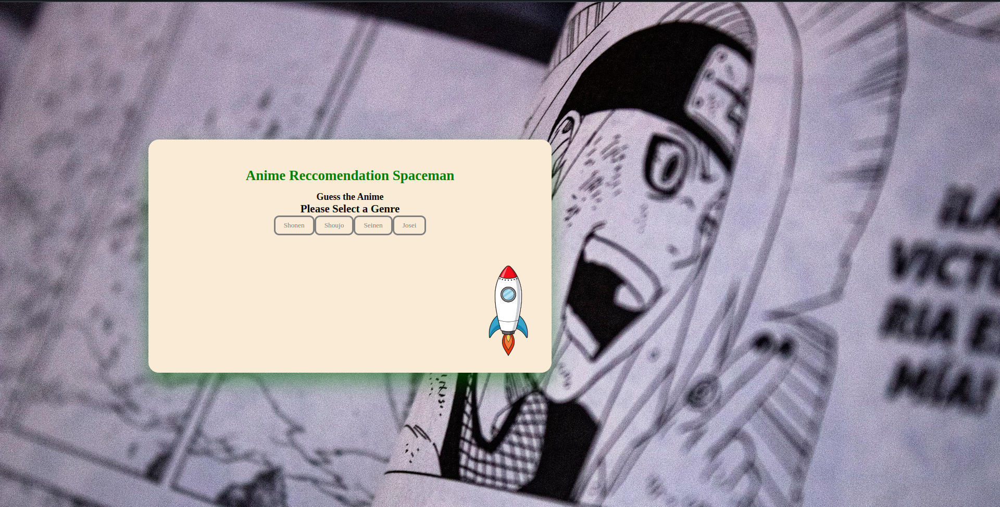
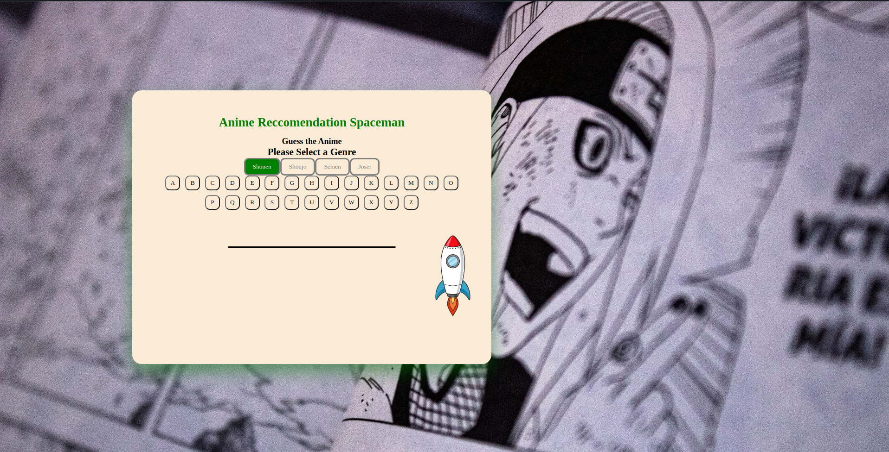
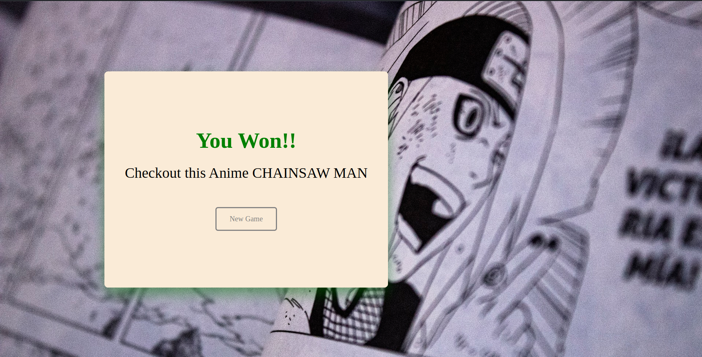
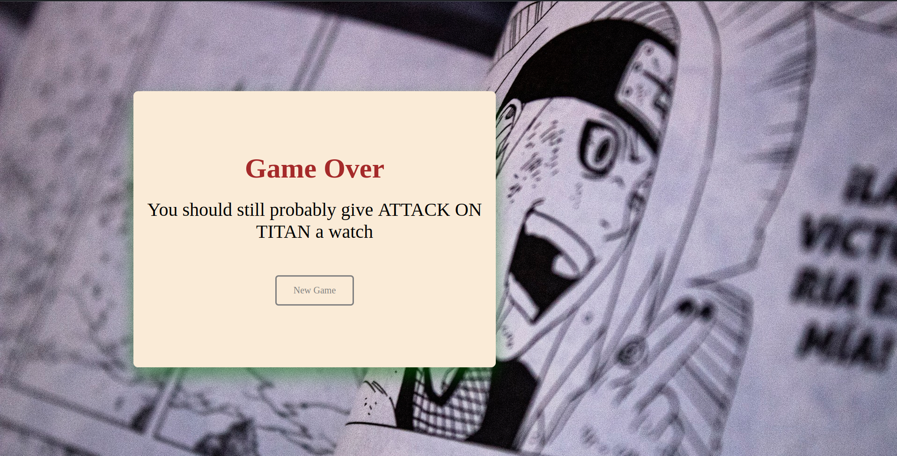

# Mitchell's Anime Recommendation Spaceman Game


## Project Goal

> It is my goal for this project to be able to create a successful and replayable Spaceman game that is unique to my intrests and personality. I plan to reach that goal by making the core theme of this game about my favorite past time Anime . In doing so I hope to stretch my creative muscles and put Javascript into a realm of comfort for myself.

## Anime Spaceman in a Snap Shot






## Technology Used

1. HTML
2. CSS
3. Vanilla Javascript
4. Removal.ai

## Getting Started

[Anime Recomendation Spaceman Link](https://pages.git.generalassemb.ly/mbanrey1/Spaceman_Project/)

### Game Instructions

1. First choose a category
2. Choose a letter of the alphabet to guess
3. Continue doing step 2 until you have won 
4. or until you have a full Spaceman and have lost
5. No matter the outcome win or lose you will be recommended an anime 
6. You may restart the game and get many more recommendation

## MVP User Story

- As a user I want to be able to pick a letter of the alphabet as a guess 
- As a user I want to be able to how close i am to losing 
- As a user I want to be able to see if i win or lose
- As a user I want to be able to see the word i won or lost against
- As a user I want to be able to start a new game
    
## Next Steps

### Version 2 User Stories

- As a user I want to be able to pick a catagory for my game
- As a user I want to be able to chose my spaceman
- As a user I want words to appear more spaced out
- As a user I want to pick word diffuculty
- As a user i want to see how many times i have won or lost this session

### Psuedo-code for Version 2

```
```
### Version 3 User Stories

- As a user I want to beable to get a much vaster list of animes
- As a user I want to be able to see the time it took me to finish the puzzle
- As a user I want to be able to save my overall progress on recommendations
- As a user I would like to be able to get a direct link to where I can watch said anime
- As a user I would like some animation and audio to go with game 

### Psuedo-code for Version 3

```
```